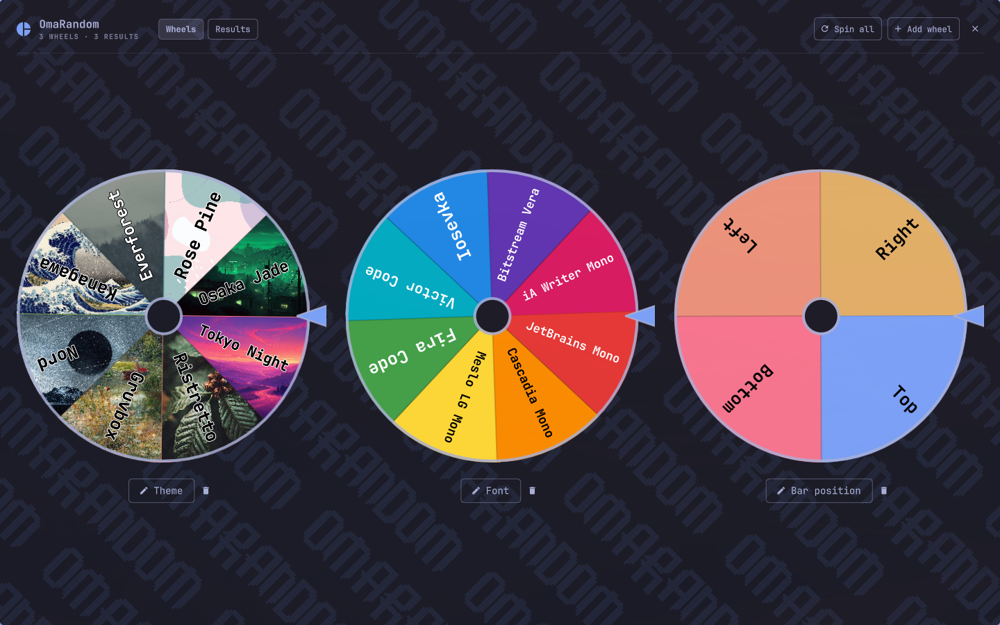
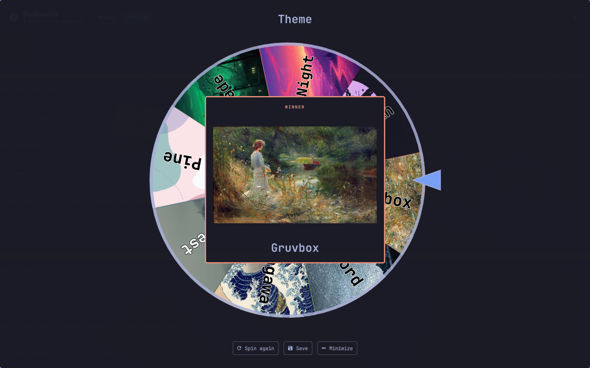
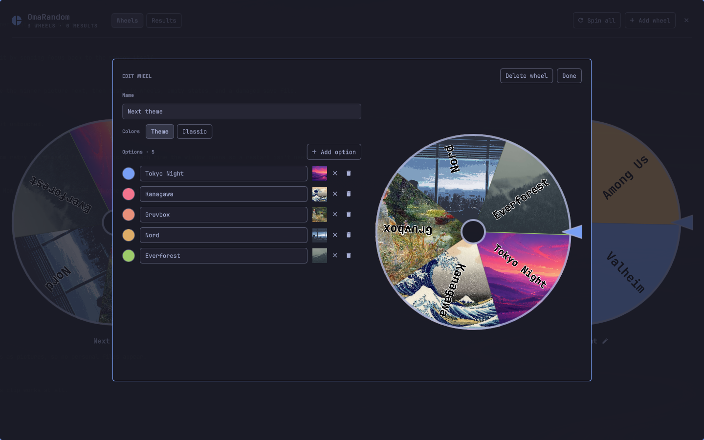
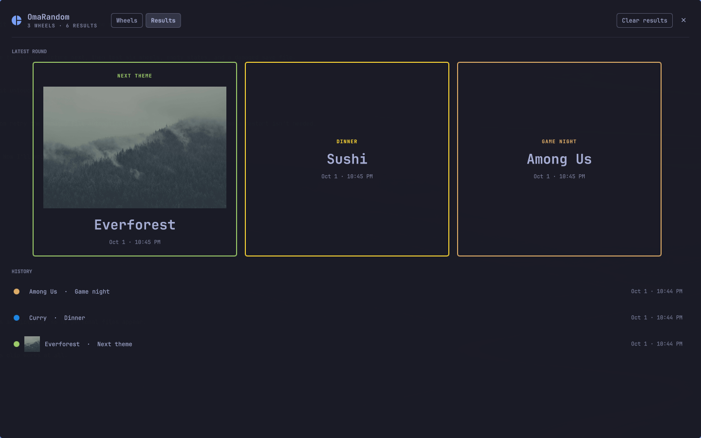

# OmaRandom

**Spin-the-wheel randomizer for the Omarchy bar.**

OmaRandom is a Quickshell plugin: a wheel icon on the bar that opens a large,
centered window with up to six spinning wheels. Name each wheel, fill it with
options, give the slices colors and pictures, then spin one wheel at a time or
spin them all and reveal the results card by card. It follows your Omarchy
theme, works offline, and runs no commands.



Plugin id: `io.github.dankestrick.omarandom`

## What it does

- **Up to six wheels.** One wheel sits in the middle; more fill out to the
  right, and a second row starts after three. Each wheel has a name and 2 to 24
  options.
- **Colors.** New wheels use your current Omarchy theme's colors, and switch
  when you change themes. Pick **Classic** for bright colors instead, or set any
  slice to its own color.
- **Pictures.** Give any option a picture from your home folder, or one of
  the Omarchy theme wallpapers with the **Wallpapers** button. It shows inside
  its slice, and large when that option wins.
- **One at a time.** Click a wheel and it grows into a large wheel. **Spin**
  (or click the wheel, or press Space) and the winner pops up over it.
  **Save** keeps that result and leaves the wheel open, so a streamer can keep
  it on screen. **Minimize** puts it back with the others.
- **Spin all.** Spins every wheel at once and saves every result. When they
  land, a **View results** button pops up in the middle of the window;
  OmaRandom never switches tabs for you.
- **Results.** The newest round shows as cards that flip over one at a time.
  Older results are listed underneath in the history; click one to bring its
  round back to the top. **Clear results** empties the top and keeps the
  history. **Clear history** deletes the history and keeps the top. With
  nothing saved yet, the tab says "Spin a wheel to generate results."
- **Idle sway.** Resting wheels rock gently back and forth.

| Spin one wheel | Edit a wheel | Results |
| --- | --- | --- |
|  |  |  |

## Install

You need [Omarchy](https://omarchy.org) 4. Nothing else.

```bash
omarchy plugin add https://github.com/Dankestrick/OmaRandom.git --enable
```

That clones into `~/.config/omarchy/plugins/io.github.dankestrick.omarandom/`
and places the icon on the **right** of the bar. To move it:

```bash
omarchy bar move io.github.dankestrick.omarandom --section left
```

There is no setup step. The window floats in the middle of the screen on its
own, with no window rule.

## Use

Click the wheel icon on the bar to open or close OmaRandom.

| Where | Key | Does |
| --- | --- | --- |
| Window | Tab | Switch between Wheels and Results |
| Window | Esc | Close OmaRandom |
| View results popup | Enter / Esc | View results / Later |
| Large wheel | Space or Enter | Spin |
| Large wheel | S | Save the result |
| Large wheel | Esc or M | Minimize |
| Editor | Esc | Done |
| Picture browser | Backspace / Esc | Up a folder / Cancel |

Click a wheel's name under it to edit the wheel. Changes save as you type.
The editor also has **Delete wheel**.

From a terminal:

```bash
omarchy-shell shell toggle io.github.dankestrick.omarandom '{}'
```

## Permissions and safety

OmaRandom runs as a normal Omarchy plugin, with your user's permissions.

- **No commands.** It is plain QML. It starts no programs, installs no
  services, needs no setup step, and never asks for root access.
- **No network.** It makes no network requests. Pictures must be local files
  (`file://`); anything else is ignored, so a picture can never make the shell
  fetch a URL. All text is shown as plain text.
- **What it reads.** Its own save file, your theme's `colors.toml` (for the
  slice colors), the folders you browse when picking a picture (only your
  home folder and the Omarchy theme wallpapers), and the pictures you choose. The picture browser is part of OmaRandom, and it only
  stores each picture's path.
- **What it writes.** One file: `~/.local/share/omarandom/omarandom.json`,
  with your wheels and up to 500 results. It is saved with an atomic write. If
  that file can't be read, OmaRandom says so and leaves it alone instead of
  replacing it. Your home folder is private on Omarchy (mode 700), so other
  users can't read it; run `chmod 600` on the file if you want it locked down
  further, and OmaRandom keeps that mode when it saves.

## Troubleshooting

| Problem | Fix |
| --- | --- |
| "OmaRandom couldn't read your saved wheels" | The save file is damaged or from a newer version. Fix or move `~/.local/share/omarandom/omarandom.json`, then open OmaRandom again. |
| A picture shows as `?` in the editor | The file moved or was deleted. Pick it again. |
| The window opened on another monitor | It opens on the monitor that has focus. |

## Remove

```bash
omarchy plugin remove io.github.dankestrick.omarandom --yes
```

That removes the plugin files and the bar icon. Omarchy keeps a backup copy
named `~/.config/omarchy/plugins/.io.github.dankestrick.omarandom.bak.<date>`,
which you can delete. Your wheels and results stay in
`~/.local/share/omarandom/`. To remove them too:

```bash
rm -rf ~/.local/share/omarandom
```

## Development

See [CONTRIBUTING.md](CONTRIBUTING.md).

## License

MIT. See [LICENSE](LICENSE).
